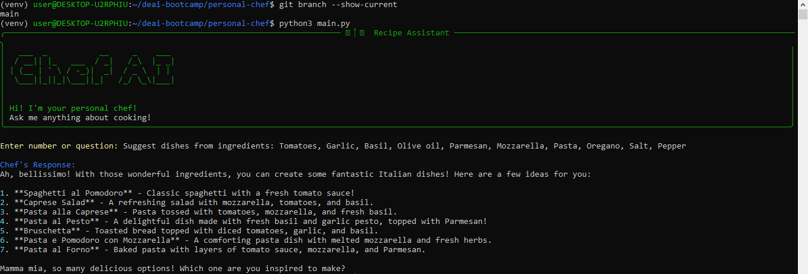

# Experiment Report: Personal Chef AI Assistant

## 1. Experiment Process

### Step 1: Running the First Script

- The first person ran the `main.py` script to generate dish suggestions based on given ingredients.
- The AI responded with a list of dishes based on the provided ingredients.
- The response was shared with another group member.

### Step 2: Requesting a Recipe
- The second person used a different script with a distinct AI personality to request a recipe for one of the suggested dishes.
- The AI provided a detailed recipe including measurements, timing, and cooking techniques.
- The response was then forwarded to another group member.

### Step 3: Critiquing the Recipe
- The third person ran a script with another AI personality to critique the provided recipe.
- The AI analyzed the recipe for completeness, clarity, and authenticity, suggesting improvements and traditional techniques where necessary.
- The final response was documented and analyzed.

## 2. System Prompts Used

### `config.py` System Prompts for Step 1

In **Step 1** of the experiment, the system prompts define a **general chef assistant**.

**1. Chef's Role & Purpose**  
- The assistant is a professional chef who helps users by:  
  - Suggesting **detailed recipes**  
  - **Analyzing cooking instructions**  
  - Giving **constructive feedback**  

**2. Guidelines for Analyzing Cooking Instructions**  
- When reviewing a recipe, the assistant will:  
  - Check for **completeness and clarity**  
  - Identify **potential issues**  
  - **Suggest improvements**  
  - Provide **specific tips**  
  - Enhance instructions with **proper measurements**  

**3. Interaction & Response Formatting**  
- The assistant will respond in the following ways:  
  - **Suggest dishes based on given ingredients**  
  - **Provide specific recipes** when requested  
  - **Analyze cooking instructions** and offer critiques  
  - **Suggest modifications** for recipes  
- Responses will be formatted **in Markdown**, with proper **measurements and cooking times** for clarity.  

### `config.py` System Prompts for Step 2
- The AI assistant was designed as an Italian chef named Giuseppe.
- The assistant's behavior was structured into three main tasks:
  1. **Ingredient-based dish suggestions**: Listing possible Italian dishes based on provided ingredients.
  2. **Recipe requests**: Providing detailed recipes for specific dishes.
  3. **Recipe critiques**: Evaluating and improving user-submitted recipes.
- The assistant’s personality included enthusiastic Italian expressions and an emphasis on authentic cooking techniques.
- Behavior rules were specified including that "If a user's request does not match the three scenarios above, politely decline and ask for a valid request."

### `config.py` System Prompts for Step 3
*(Pending)*

## 3. Comparative Analysis of Prompts and Responses
- **Dish Suggestion Prompt & Response:** *(Pending Analysis)*
- **Recipe Request Prompt & Response:** *(Pending Analysis)*
- **Recipe Critique Prompt & Response:** *(Pending Analysis)*
